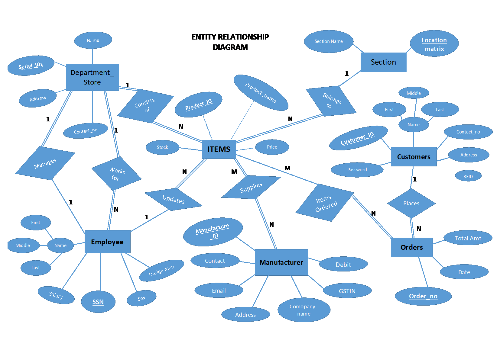
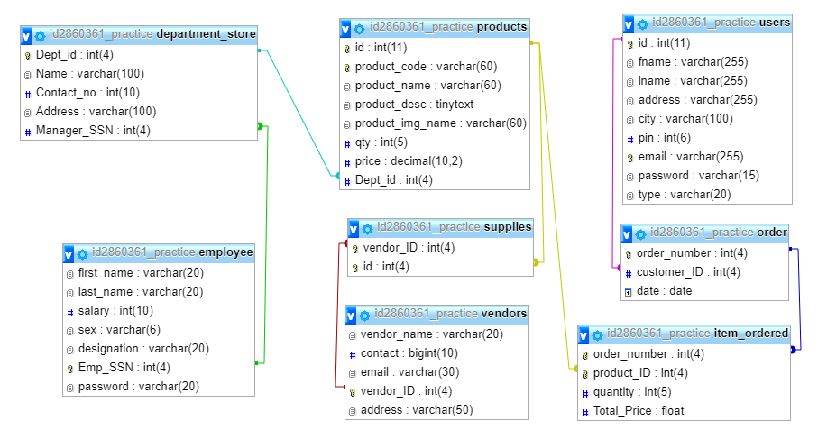

# Enzo_Automation
Automating Enzo by bringing it online ad giving the students facility to order before hand.

This project is a database management system on Departmental Store and it's automation. Management System makes storage of large bulk of data easier and more organized. We have a database management system that will store the information regarding the customer, orders, products, item ordered, manufacturers and employees in a systematic and well-defined ordered manner. This system gives the management an efficient way to handle their main operational areas such as customer care, inventory control, the point of sales and analysis and automation.

